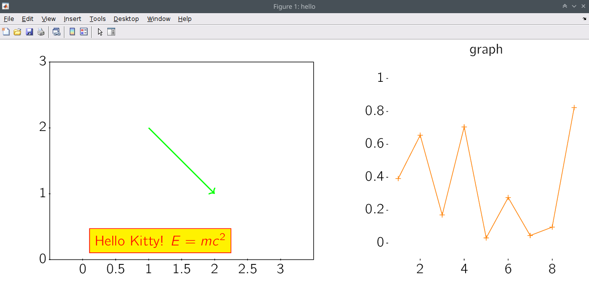
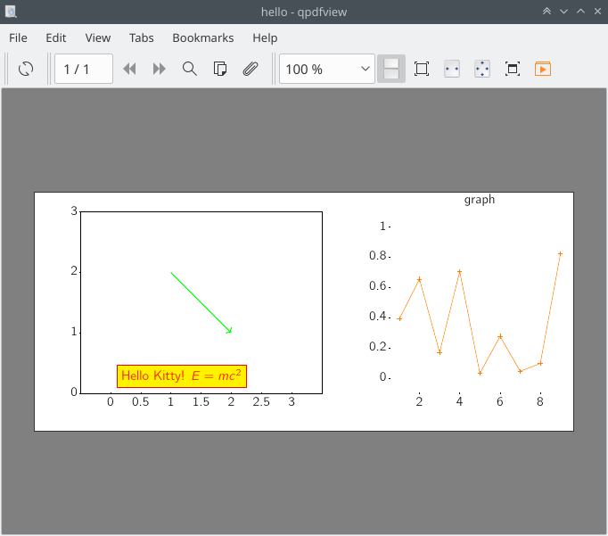

# Create Ti*k*Z/pgf figures from Matlab

tikzfig is a Matlab toolbox to programmatically create figure files in pdf format using the [Ti*k*Z/pgf LaTeX package](https://ctan.org/pkg/pgf?lang=en). It exposes part of the Ti*k*Z interface to pgf as a Matlab API, so that graphics statements lead to the construction of a LaTeX file which is transparently processed into pdf, including a simple preview mechanism. Additionally, functionality to easily create multi-panel figure layouts is provided.

I created this toolbox because the capabilities of Ti*k*Z go far beyond what can be reasonably achieved with Matlab's graphics, both in versatility and quality. To get an impression, have a look at the [Ti*k*Z and PGF examples on texample.net](http://www.texample.net/tikz/examples/all/). The drawback is that this toolbox as well as Ti*k*Z/pgf itself cannot be used interactively, for fast prototyping. Its purpose is to produce high-quality publication-ready figures.


## Installation

Copy the contents of the repository into a directory on your computer and add that directory to the Matlab path.

To create the pdf, the external command `pdflatex` is called, and to generate the preview, the external command `gs` (ghostscript) is called. Both programs therefore need to be installed. The generated LaTeX code depends on the packages `tikz`, `inputenc`, `fontenc`, `cmbright`, and `amsmath`. The code has only been tested on Debian GNU/Linux, with LaTeX installed from the `texlive-` packages.


## Example

An example tikzfig script is contained in the file `example.m`:

```matlab
% create a figure named "hello" (associated with a Matlab figure window)
tfInit('hello')
% define a color to be used later
tfColor('kitty', 'rgb', [1 0 0])
% define a style to be used later
tfStyle('pretty', 'mark=+,draw=orange')
% define a layout with two boxes side-by-side,
% the first with a 4:3 aspect ratio and the second one square
tfLayout({1 1 4/3; 1 2 1})

% select layout box #1 and define coordinate system
tfView(1, [0 3], [0 3])
tfIsoView
% draw an arrow from (1, 2) to (2, 1)
tfPath('green,thick,draw,->', [1 2 ; 2 1])
% make a text label
tfPath('', [0.1 0.1], ...
    'node [kitty,anchor=south west,draw,fill=yellow] {Hello Kitty! $E = mc^2$}')
% close layout box and show standard decorations: viewbox and scales
tfDeco

% select layout box #2 and define coordinate system
tfView(2, [0.5 9.5], [-0.1 1.1])
% plot some random data
tfPlot('pretty', [1 : 9 ; rand(1, 9)]')
% close layout box and use scales and a title as decorations
tfDeco scales
tfDeco title graph

% generate pdf and show a preview in the associated figure window
tfRender
```

The last command shows a preview in a figure window:



The file `hello.pdf` is created in the current directory:




## Usage

The basic structure of a tikzfig script is
-   `tfInit`: initialize Ti*k*Z figure
-   style commands
-   `tfLayout`: organize the layout of a Ti*k*Z figure using boxes (views) arranged over a grid
-   for each view:
    -   `tfView`: prepare layout box as current view
    -   optionally `tfIsoView`: impose isoscaling on the current view
    -   plot commands
    -   optionally `tfDeco`: draw decorations for the current view
-   `tfRender`: render Ti*k*Z figure to pdf file and show a preview

Style commands:
-   `tfColor`: define color for later use in drawing or filling
-   `tfStyle`: define Ti*k*Z style for later use in options

Plot commands:
-   `tfPath`: insert path in current view
-   `tfPlot`: plot data in current view
-   `tfScatter`: generate scatter plot in current view
-   `tfHeatMap`: display matrix as a heat map
-   `tfImage`: insert image into the current view
-   `tfContour`: display matrix as a contour plot
-   `tfEllipse`: draw a circle or ellipse in the current view
-   `tfArrow`: draw arrow
-   `tfColorBar`: fill pre-defined layout box with colorbar
-   `tfGrid`: draw a coordinate grid into the current view
             
Helper functions:
-   `tfPrintCode`: print Ti*k*Z LaTeX code
-   `tfLimits`: compute fitting view limits for discretely sampled data (e.g. images)

All functions include additional usage information which is accessible via Matlab's `help` command. To use this toolbox effectively, you should however familiarize yourself with Ti*k*Z itself.

***

This software is copyrighted © 2019 by Carsten Allefeld and released under the terms of the GNU General Public License, version 3 or later.

